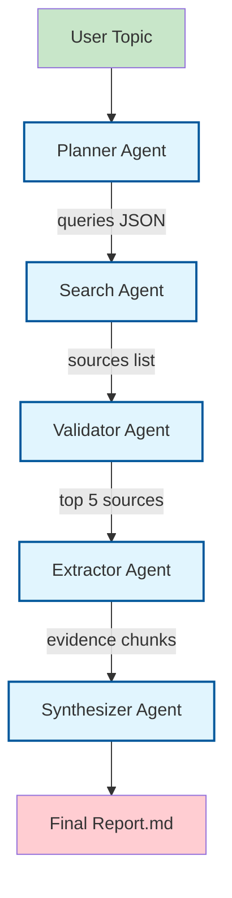

# Multi-Agent Research Citation Engine

A production-grade AI research assistant built with **CrewAI** in Python.  
Enter any research topic and receive a structured report with accurate citations,
extracted evidence, and verified references — similar to Perplexity Deep Research
or Elicit, but fully open and customisable.

---

---

## What It Does

1. **Planner Agent** decomposes your topic into 4–6 targeted search queries
2. **Search Agent** retrieves up to 8 sources per query from arXiv, IEEE, ACL, GitHub, and official docs via Exa and Tavily APIs
3. **Validator Agent** scores every source (1–10) on credibility, recency, and technical depth — keeps only the top 5
4. **Extractor Agent** fetches each source (PDF or webpage), chunks the text, and extracts metrics, datasets, findings, and verbatim quotes
5. **Synthesizer Agent** merges all evidence into a structured Markdown report with inline citations — no hallucination, every claim is grounded

---

## Architecture




All agents communicate via **structured JSON only** — never raw documents.

---

## Quick Start

### 1. Clone & install

```bash
git clone <repo-url>
cd research_crew
python -m venv .venv && .venv\Scripts\activate
pip install -r requirements.txt
```

### 2. Configure API keys

```bash
cp .env.example .env  # if exists, or create .env
# Edit .env and fill in your keys
```

| Variable | Required | Description |
|---|---|---|
| `OPENAI_API_KEY` | ✅ | OpenAI API key |
| `EXA_API_KEY` | ✅ | [Exa](https://exa.ai) neural search key |
| `TAVILY_API_KEY` | Recommended | [Tavily](https://tavily.com) fallback search |
| `LLM_MODEL` | Optional | Model name (default: `gpt-4o`) |
| `LLM_TEMPERATURE` | Optional | Temperature (default: `0.3`) |
| `OUTPUT_FILE` | Optional | Report save path (default: `outputs/research_report.md`) |

### 3. Run

```bash
# Interactive mode
python -m research_crew.main

# Topic as argument
python -m research_crew.main --topic "Covid-19"

# Custom output file
python -m research_crew.main --topic "diffusion models" --output diffusion.md
```

---

## Project Structure

```
multi-agent-researcher-2/
├── research_crew/
│   ├── agents/
│   │   ├── planner_agent.py       # Research Strategist
│   │   ├── search_agent.py        # Academic Source Finder
│   │   ├── validator_agent.py     # Source Quality Evaluator
│   │   ├── extractor_agent.py     # Technical Evidence Extractor
│   │   └── synthesizer_agent.py   # Research Writer
│   ├── tasks/
│   │   ├── planning_task.py       # Query decomposition task
│   │   ├── search_task.py         # Source retrieval task
│   │   ├── validation_task.py     # Source scoring & filtering task
│   │   ├── extraction_task.py     # Evidence extraction task
│   │   └── summary_task.py        # Final report generation task
│   ├── tools/
│   │   ├── search_tool.py         # Exa + Tavily search tools
│   │   ├── pdf_extractor.py       # PyMuPDF PDF text extractor
│   │   └── web_parser.py          # BeautifulSoup webpage parser
│   ├── utils/
│   │   ├── token_utils.py         # count_tokens, truncate_text
│   │   └── text_chunker.py        # chunk_text with overlap
│   └── main.py                    # CLI entry point & pipeline runner
├── requirements.txt
├── research_crew.log             # CrewAI logs
├── .env.example
└── README.md
```


---

The system enforces strict limits at every layer:

| Layer | Limit | Mechanism |
|---|---|---|
| Document download | 10 MB | Streaming cap in `tools/pdf_extractor.py` |
| Extracted text per source | 3 000 chars | Hard truncation in tools |
| Text chunks | 800 tokens | `utils/text_chunker.py` |
| Evidence per source | 300 tokens | Agent instruction + task constraint |
| LLM calls | Retried on 429 | `tenacity` exponential backoff |

---

## Output Format

```markdown
# 🔴 **Final Report** *(Red Header)*

# 🟢 **Research Summary: <Topic>** *(Green Title)*

## 💙 **Key Insights** *(Blue Section)*

🟢 **1. <Headline>** *(Green List)*
   > Supporting evidence, 2–4 sentences.
   
   *🌟 Source: [1]* *(Gold Citation)*

## 💜 **Methodology Overview** *(Purple Section)*
> 💙 Concise description drawn from extracted methodology snippets. *(Blue Text)*

## 🟣 **Benchmarks & Metrics** *(Purple Table)*
| 🔵 Metric | 🟡 Value | 🔗 Source |
|-----------|----------|-----------|
| ... | ... | [1] |

## 🟠 **Refinement & Iterative Improvement** *(Orange Section)*

**Iteration 1 (Initial):**
> Basic structure present but limited depth. *(Gray)*

**Iteration 2 (Correction):**
> Improved structure, added citations, better clarity. *(Gray)*

**Iteration 3 (Refinement):**
> Added benchmarks, improved completeness and explanation. *(Gray)*

---

**⏱️ Generated in {total_time}s**  
**📊 Quality Scores: {quality_scores}** *(Teal Stats)*

## ❤️ **Sources** *(Pink Section)*

**[1] <Title>**  
`📎 <URL>` *(Blue Link)*
```


---

## Extending the System

| Goal | Where to change |
|---|---|
| Add a new search backend | `tools/search_tool.py` — create a new `BaseTool` subclass |
| Change number of top sources | `tasks/validation_task.py` — update the "keep TOP N" instruction |
| Support local LLMs (Ollama) | `main.py` `_build_llm()` — swap `LLM(model="ollama/...")` |
| Add memory across sessions | `main.py` Crew constructor — set `memory=True` and configure a vector store |
| Export to PDF | Post-process `outputs/research_report.md` with `pandoc` or `weasyprint` |

---

## Requirements

- Python ≥ 3.10
- OpenAI API key with GPT-4o access
- Exa API key (free tier available at [exa.ai](https://exa.ai))
- Tavily API key (optional, free tier at [tavily.com](https://tavily.com))

---


## 📈 Output

### 📝 Generated Reports
- Initial Report  
- Corrected Report  
- Refined Final Report  

### 📊 Performance Graph


**Graph Shows:**
- Iteration Number vs Quality Score
- Improvement Trend
- Convergence Behavior

---

## 🧠 Agents in the System

| Agent        | Role |
|-------------|------|
| Researcher  | Collects factual information |
| Writer      | Generates and improves reports |
| Verifier    | Validates correctness and structure |
| Analyst     | Explains workflow improvements |

---

## 🛠️ Setup Instructions

### 1️⃣ Clone the Repository

```bash
git clone https://github.com/sujal-SM/agentic-ai-framework.git
cd agentic-ai-framework
```
### Create Virtual Environment
```bash
python -m venv venv
source venv/bin/activate      # Mac/Linux
venv\Scripts\activate         # Windows
```
### Setup Environment Variables
```bash
Create a .env file:

OPENAI_API_KEY=your_api_key_here
```

📜 License

This project is licensed under the MIT License.